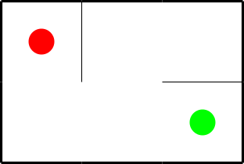

% Proving Existence of Maze Solutions in Zero Knowledge
% v0.1 2022-03-27

# Changelog

## v0.1 2022-03-27

Initial version


# Introduction

This document describes the details of the zero knowledge proof of
existence of a solution to a maze puzzle. The project was created
during the Encode StarkNet hackathon to demonstrate, that Cairo
language can be used pro prove claims about graph theory statements.

The project contains a piece of software which generates unique mazes
of various shapes using a random generator. The output of the software
is a printable picture of the maze in either SVG or PDF format and a
set of files which describe the maze graph and the maze solution. These
files can be used as an input to a Cairo program which proves the existence
of the solution. Then, the solution is deleted and the resulting maze together
with the proof is sent to the user.

# Maze Data

A maze consists of several rooms separated by walls. One of the rooms
is the start room (a red dot in the Figure 1), another one is the
target room (a green dot). Some of the walls contain open doors. The
gooal is to find a path from the start room to the target room which
which goes only through the open doors.



The maze structure file `maze.mas` contains the generic structure of a
maze of certain size. For example all rectangular mazes with width of
3 rooms and height of 2 rooms have the same structure file.

Then there is the maze instance file `maze.mai` which define a concrete
instance of the maze of certain structure. The file simply determines,
which walls of the generic maze structure are open and which are
closes.

The solution file `maze.mas` contains a path in the maze which solves
the puzzle.

All three files are text files containing one decimal integer per line.

Rooms in the maze structure are numbered by integers from $0$ to $R-1$
where $R$ is the number of the rooms in the maze. Similarly, walls
have numbers from $0$ to $W-1$. The room $0$ is the start room, the
target room has number $R-1$.

For the purpose of the maze solution proof, the each room is assigned
an unique prime $p_i$. The algorithm uses consecutive primes in their
natural order that is, $p_0 = 2, p_1 = 3, ...$.


The following table demonstates room numbering for the maze of Figure 1 together with the assigned primes.

```


   ---------------- ---------------- ---------------- 
  |                |                |                |
  |                |                |                |
  |   r  = 0       |   r = 1        |   r = 2        |
  |                |                |                |
  |   prime = 2    |   prime = 3    |   prime = 5    |
  |                |                |                |
  |                |                |                |
   ---------------- ---------------- ----------------
  |                |                |                |
  |                |                |                |
  |   r = 3        |   r = 4        |   r = 5        |
  |                |                |                |
  |   prime = 7    |   prime = 11   |   prime = 13   |
  |                |                |                |
  |                |                |                |
   ---------------- ---------------- ---------------- 
```
Room numbering for the maze from Figure 1.

The maze structure file contains on the first line the number of rooms
$R$, then the number of walls $W$. Next $R$ lines are taken by the
primes $p_0$ to $p_{R-1}$.  Then $W$ lines contain definition of the
walls - a wall $w$ between the room $i$ and $j$ is represented as the
product of primes $q_w := p_i p_j$.

The wall numbering and the products $q$ for our example maze:


```
   ---------------- ---------------- ---------------- 
  |                |                |                |
  |                |                |                |
  |               [0]              [1]               |
  |              (q=6)            (q=15)             |
  |                |                |                |
  |                |                |                |
  |                |                |                |
   ------[4]------- -------[5]------ -------[6]------
  |     (q=14)     |      (q=33)    |      (q=65)    |
  |                |                |                |
  |                |                |                |
  |               [2]              [3]               |
  |              (q=77)          (q=143)             |
  |                |                |                |
  |                |                |                |
   ---------------- ---------------- ---------------- 
```
Wall numbering for the maze from Figure 1.

The maze instance file consists of $W$ lines containing either $1$ if
the wall is closed or $0$ if there is a door in the  wall.

The first line of the maze solution file contains the path length $P$
that is the number of rooms in the path. The follows $2 * P - 1$
numbers - an array af alternating room and wall indices on the path:
firts room index, first wall index, second room index and so on. The
first room index must correspond to the start room $0$, the last room
index to the target room $R-1$.

Let's demonstrate the content  of the files on an example of $3 \times 2$
rectangular maze.

```
6
7
2
3
5
7
11
13
6
15
77
143
14
33
65
```
Maze structure for the maze from Figure 1.


```
1
0
0
0
0
0
1
```
Maze instance for the maze from Figure 1.


```
4
0
4
3
2
4
3
5
```
Maze path for the maze from Figure 1.

The path visit $4$ rooms starting at the room $0$ and finishing at
$5$. Three walls are crossed: $4$, $2$, and $3$.


# Cairo generated proof

Cairo generated proof asserts the following claims about the maze and its solution:

1)  The first room of the solution  must be the starting room of the maze $0$.

2) The last room of the solution must be the target room of the maze.

3) For each step of the path which consists of the first room index
$r_1$ a wall index $w$ and the second room index $r_2$ the indices are
in range $0 \le r_1 < R$, $0 \le r_2 < R$, and $0 \le w < W$.

4) The wall $w$ is open in the instance.

5) Path continuity: the product of primes corresponding to the wall
$w$ in maze structure file $q_w$ is equal to the product of primes
corresponding to the rooms in the same file $p_{r1} p_{r2} = q_w$.

6) Finally, the Cairo program computes hashes of the input data and
prints them on a standard input. The `hash_chain` method is used with
the pedersen hash. The output numbers are: the hash of the room
primes, the room of wall products and the hash of the instance
array. For a prover to trust the proof it is necessary to compute the
hashes independently using the definition from Cairo reference
https://www.cairo-lang.org/docs/reference/index.html .

# Validation routine

```
Program output:
  354616993805219854469230246574830712085999748313397559603019881205245642315
  -292864631950751749558701068235696640484880265131051778176622886459118047166
  -209360962985909177064737217756316258878090652956518401472373918138936560489

Job key: 2c9abc13-8869-41a9-a66b-0dc506ba8ad4
Fact: 0x565e26c2712d5d02cb9d6677b18809ffd04de15fea20d6976054e9ab372546f2
```


The user must do the following steps to validate the proof:

1) Validate the result of the SHARP shared prover using the
instructions on https://www.cairo-lang.org/docs/sharp.html . The job
key and the fact can be obtained from the proof protocol which can be
downloaded together with the maze.

2) Validate that the maze structure file `maze.mas` and `maze.mai` correspond to the SVG image.

3) Independently compute hashes of the files and compare them to the
hashes from the proof protocol.
